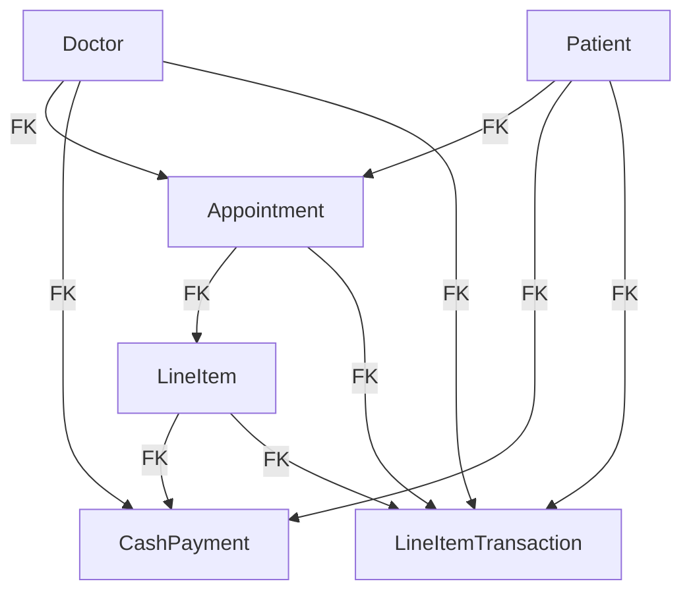

Directory Structure:

``` bash
.
├── Makefile  # contains commands for building/destroying containers & services
├── Pipfile
├── Pipfile.lock
├── README.md
├── app  # the main python app for creating data models on MySQL
│   ├── Dockerfile
│   ├── Pipfile
│   ├── Pipfile.lock
│   ├── __init__.py
│   ├── config.py  # stores ENVVARS and contains getters for DB connections etc.
│   ├── crud.py  # script. Calls the functions for creating & populating DB tables
│   ├── entrypoint.sh  # runs on launch
│   ├── factories.py
│   ├── models.py  # defines data models.
│   ├── olap.py  # Script used by DuckDB but maintained here for common dependencies
│   └── replicate_to_s3.py  # Script to replicate data from MySQL to "s3" bucket.
├── docker-compose.yml  # specifies all the Docker containers
├── duck  # for DuckDB
│   ├── Dockerfile
│   └── mv_example.sql
├── k8s  # for kubernetes stuff  
│   └── lightdash
│       └── values.yaml
|── terraform  # TODO
|   └── main.tf
|── .env  # envvars
```



Lightdash
```bash
# install dependencies
brew install minikube
minikube start --memory=2048 --cpus=2 --driver=docker
helm repo add lightdash https://lightdash.github.io/helm-charts
kubectl create namespace lightdash
cd ./k8s/lightdash
helm install lightdash lightdash/lightdash -n lightdash -f values.yaml
```

To tear down:
```bash
helm uninstall lightdash -n lightdash
minikube delete --all --purge
```

To start over:
```bash
minikube start --memory=4096 --cpus=2 --driver=docker
helm install lightdash lightdash/lightdash -n lightdash -f values.yaml
```