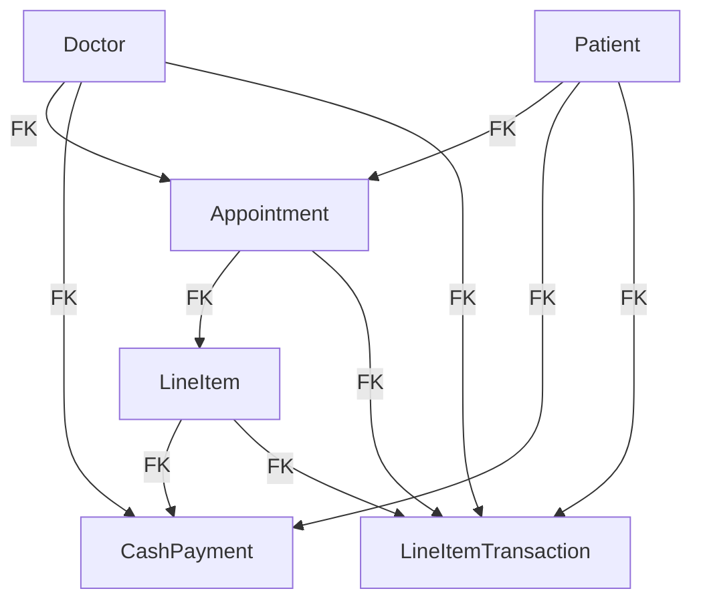

Directory Structure:

``` bash
.
├── Makefile  # contains commands for building/destroying containers & services
├── Pipfile
├── Pipfile.lock
├── README.md
├── app  # the main python app for creating data models on MySQL
│   ├── Dockerfile
│   ├── Pipfile
│   ├── Pipfile.lock
│   ├── __init__.py
│   ├── config.py  # stores ENVVARS and contains getters for DB connections etc.
│   ├── crud.py  # script. Calls the functions for creating & populating DB tables
│   ├── entrypoint.sh  # runs on launch
│   ├── factories.py
│   ├── models.py  # defines data models.
│   ├── olap.py  # Script used by DuckDB but maintained here for common dependencies
│   └── replicate_to_s3.py  # Script to replicate data from MySQL to "s3" bucket.
├── docker-compose.yml  # specifies all the Docker containers
├── duck  # for DuckDB
│   ├── Dockerfile
│   └── mv_example.sql
├── k8s  # for kubernetes stuff  
│   └── lightdash
│       └── values.yaml
│── terraform  # TODO
│   └── main.tf
│── .env  # envvars
```




Connecting to Postgres:
```bash
psql --host=eh-reporting-pg-dev.<hash>.us-east-2.rds.amazonaws.com --port=5432 --username=postgres --password --dbname=postgres
```

----
```bash
# First find the IP and port of Lightdash pods
export NODE_PORT=$(kubectl get --namespace lightdash -o jsonpath="{.spec.ports[0].nodePort}" services lightdash)
export NODE_IP=$(kubectl get nodes --namespace lightdash -o jsonpath="{.items[0].status.addresses[0].address}")
echo http://$NODE_IP:$NODE_PORT

# then go to that http://ip.add.ress::PORT

#1 install lightdash CLI
npm install -g @lightdash/cli@0.702.0

#2 login to lightdash -- replace with the ports from 
lightdash login http://192.168.65.2:31478/ --token 72e551a19845e43ca485a7e2d05eaefa

#3 create project
lightdash deploy --create
```